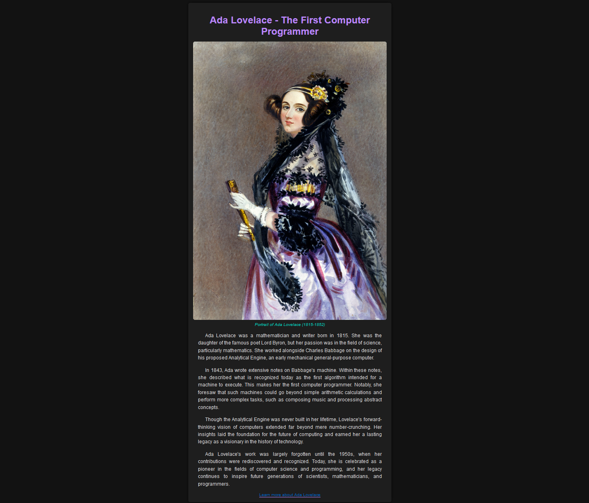

# **Ada Lovelace Tribute Page** 🖥️

## **Description**

This is a tribute page dedicated to **Ada Lovelace**, the first computer programmer. The page provides a brief biography of Ada Lovelace and highlights her contributions to the field of computing.

## **Screenshot**



## 🚀 **Features**
- A main section with a title describing the subject of the tribute page.
- An image of Ada Lovelace with a caption.
- A section outlining Ada Lovelace's life and achievements.
- A link to an external site for more information.

## 🛠️ **Technologies Used**
- HTML
- CSS

## 💻 **How to View the Page**
1. Clone the repository to your local machine:
   ```bash
   git clone https://github.com/i-Glitchx/ada-lovelace-tribute-page.git
   ```

2. Navigate to the project directory:
   ```bash
   cd ada-lovelace-tribute-page
   ```


3. Open the `Ada-Lovelace-Tribute-Page.html` file in your web browser.

## 📖 **Learn More** 

To dive deeper into the story of **Ada Lovelace**, you can explore her [Wikipedia page](https://en.wikipedia.org/wiki/Ada_Lovelace).

## 👤 **Author** 

[i-Glitchx](https://github.com/i-Glitchx)

## 🔗 **Links** 

- [View the repository](https://github.com/i-Glitchx/Ada-Lovelace-Tribute-Page/tree/main)

## 📜 **License** 

This project is licensed under the MIT License. See the [LICENSE](LICENSE) file for details.
